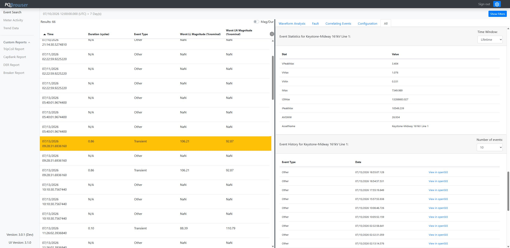

<div align="center">
  <picture>
    <source media="(prefers-color-scheme: dark)" srcset="PQBrowser/wwwroot/Images/PQBrowserLight.png">
    <source media="(prefers-color-scheme: light)" srcset="PQBrowser/wwwroot/Images/PQBrowserDark.png">
    
  </picture>
</div>

# PQ Browser

PQ Browser is a list-based power-quality event browser that complements the graphical filtering and drill-down workflows in Open PQ Dashboard. It brings event search, operational context, and configurable analysis widgets together in a single view.



*Event Search with a transient event selected and the populated **All** widget view.*

## Highlights

- Search events by time range, event type, magnitude and duration, phase, meter, asset, asset group, or substation.
- Select an event to inspect waveform analysis, fault details, correlated events, configuration data, statistics, and event history without leaving the results list.
- Review meter activity and trend data alongside the event-search workflow.
- Run operational reports for trip coils, capacitor banks, DERs, and breakers.

## Development

The application targets .NET 9 and builds its React/TypeScript interface with npm and webpack. After configuring the required database and service connections:

```powershell
cd PQBrowser
npm run builddev
dotnet run
```
